# Práctica: Persistencia de Datos con Docker Volumes y PostgreSQL

## 1. Título
**Implementación de Persistencia en PostgreSQL usando Volúmenes de Docker**

## 2. Tiempo de duración
**90 minutos**

## 3. Fundamentos

Anterionrmente se evidenció que DOCKER es una plataforma que permite crear, ejecutar y gestionar contenedores. Un contenedor es una unidad ligera y portátil de software que incluye todo lo necesario para ejecutar una aplicación. En este caso, se usó Docker para levantar una base de datos PostgreSQL con persistencia de datos, utilizando volúmenes.

Ahora vamos a profundizar en los volúmenes en Docker, son una manera de almacenar datos fuera del contenedor, de modo que cuando el contenedor se elimina los datos permanezcan disponibles. Esto es especialmente útil para bases de datos, donde la persistencia es crucial.

**PostgreSQL**

PostgreSQL es un sistema de gestión de bases de datos relacional y open source que permite almacenar, modificar y consultar datos de forma eficiente.

Cuando un contenedor se crea sin un volumen, los datos generados dentro del contenedor desaparecen al eliminarlo. Al usar volúmenes, se puede mantener la información incluso si el contenedor es destruido y vuelto a crear.

A continuación, se muestra cómo Docker maneja los volúmenes:

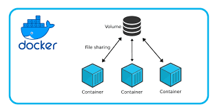

*Figura 3-1. Volúmenes en Docker. Fuente: Docker Docs*

En esta práctica, se crea un contenedor PostgreSQL, se conecta a través de un administrador gráfico como DataGrip, se crean tablas y se insertan registros. Luego, se detiene y elimina el contenedor, y al volverlo a crear usando el volumen, se comprueba que los datos siguen estando allí.

## 4. Conocimientos previos

Para realizar esta práctica, el estudiante necesitó tener claro los siguientes temas:

- Comandos básicos de Linux.
- Instalación y manejo de Docker.
- Comandos para administración de contenedores (`docker run`, `docker stop`, `docker rm`, etc).
- Conexión de PostgreSQL con herramientas externas como DataGrip.
- Creación de bases de datos y tablas SQL.

## 5. Objetivos a alcanzar

- Implementar contenedores con PostgreSQL.
- Asociar un volumen al contenedor para garantizar persistencia de datos.
- Manipular bases de datos desde un administrador gráfico como DataGrip.
- Verificar la persistencia de datos después de reiniciar el contenedor.

## 6. Equipo necesario

- Computadora con sistema operativo Linux.
- Docker instalado.
- Acceso a internet.
- Editor gráfico para bases de datos como DataGrip.

## 7. Material de apoyo

- [Documentación oficial de Docker](https://docs.docker.com)
- [Documentación de PostgreSQL](https://www.postgresql.org/docs/)
- Guía de asignatura
- Linux Cheat Sheet (https://cheatography.com/davechild/cheat-sheets/linux-command-line/)

## 8. Procedimiento

# Parte 1

**Paso 1:** Crear el contenedor PostgreSQL .

```bash
docker run --name server_db1 -e POSTGRES_PASSWORD=admin123 -p 5432:5432 postgres
```
**Paso 2:** Conectarse al contenedor desde DataGrip usando los siguientes datos:
- Host: `localhost`
- Puerto: `5432`
- Usuario: `postgres`
- Contraseña: `admin123`

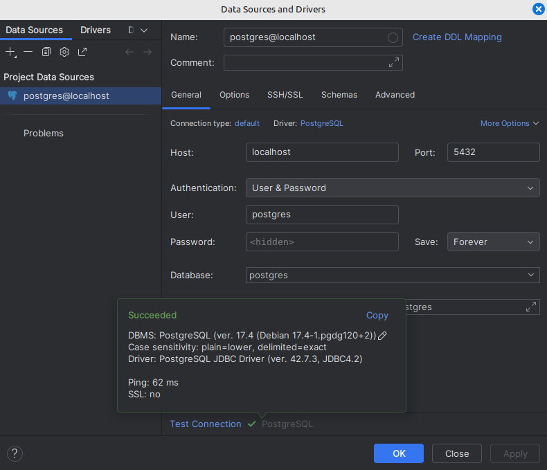

**Paso 3:** Crear la base de datos y dentro de ella crear la tabla `customer`.

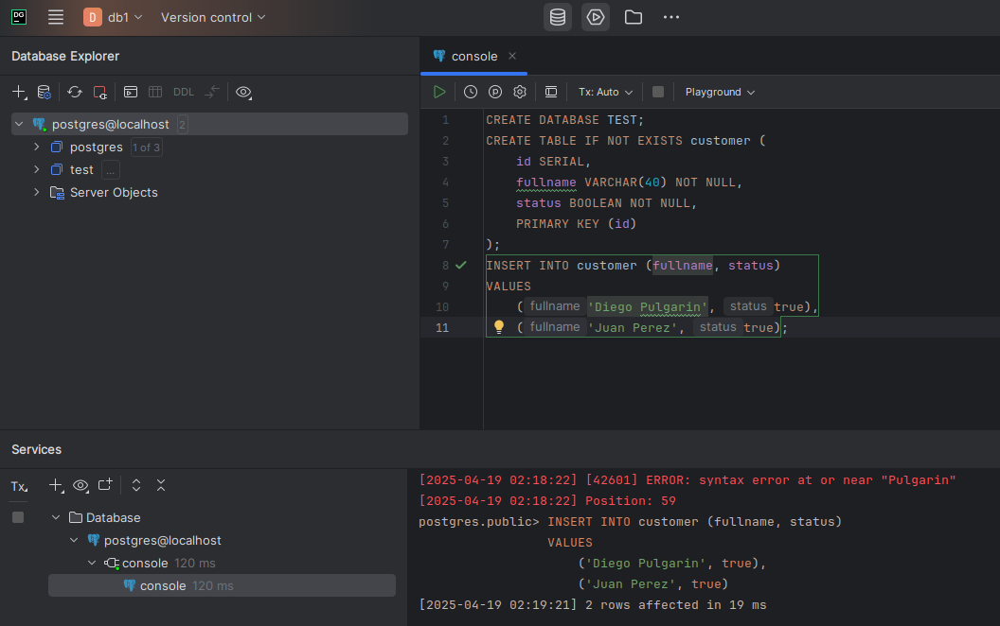

**Paso 4:** Comprobar desde docker que los tatos existen.

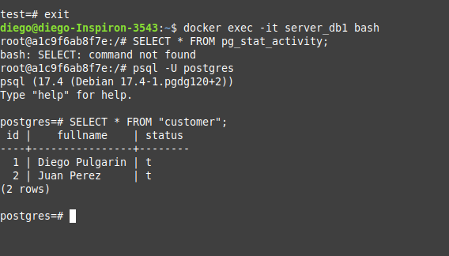

**Paso 5:** Eliminar el contenedor y volverlo a crear.

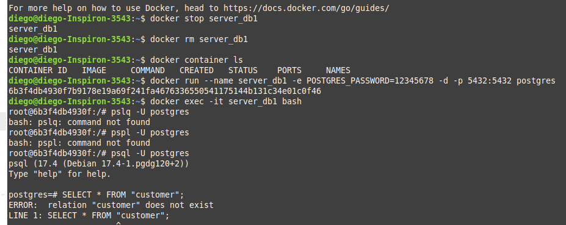

**Resultado:** Tanto en docker como en DataGrip podemos ver que la base de datos ya no existe ni su contenido.

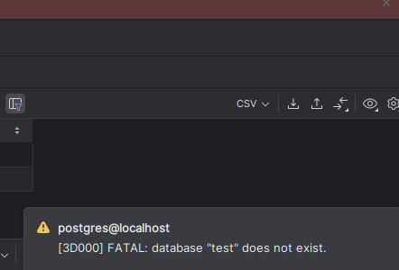

# Parte 2

**Paso 1:** Crear un volumen llamado `pgdata`.

```bash
docker volume create pgdata
```

**Paso 2:** Crear el contenedor PostgreSQL con el volumen asociado.

```bash
docker run --name server_db2 -e POSTGRES_PASSWORD=admin123 -v pgdata:/var/lib/postgresql/data -d -p 5433:5432 postgres
```
Cambiamos el puerto externo a 5433 ya que server_db1 sigue corriendo en el 5432

**Paso 3:** Conectarse al contenedor desde DataGrip usando los siguientes datos:
- Host: `localhost`
- Puerto: `5432`
- Usuario: `postgres`
- Contraseña: `admin123`

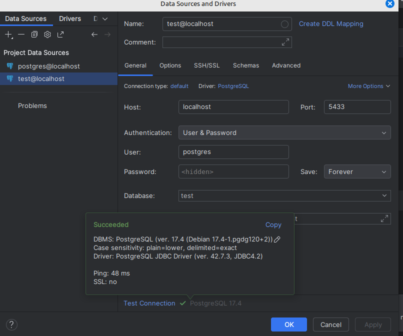

**Paso 4:** Crear la base de datos `test`, y dentro de ella crear la tabla `customer`.

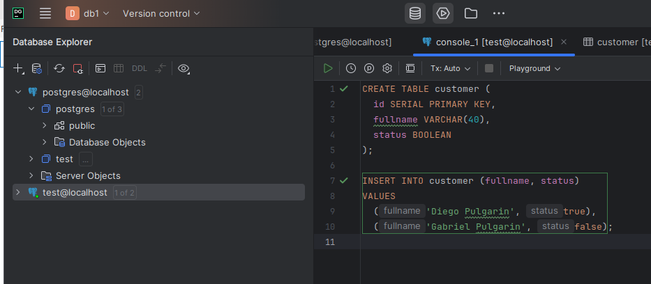

**Paso 5:** Verificar que la tabla y datos existen.

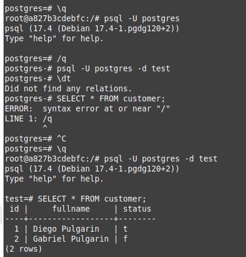

**Paso 6:** Eliminar el contenedor, volverlo a crear asociado al mismo volumen y verificar que los datos existen.

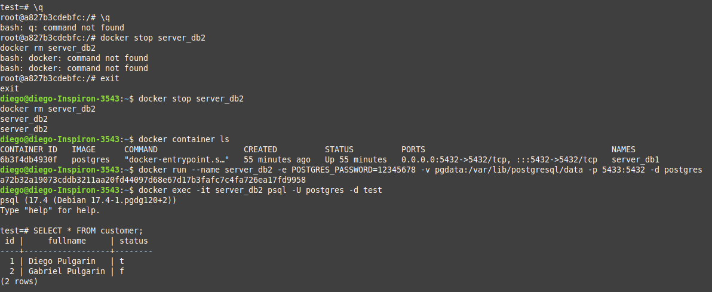

**Paso 7:** Conectarse nuevamente desde DataGrip y verificar que la base de datos y los datos siguen existiendo.

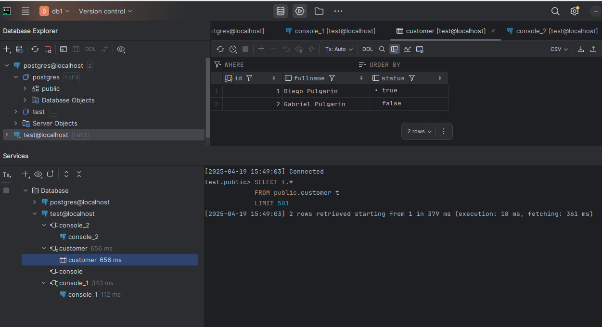

**Resultado:** Tanto en docker como en DataGrip podemos ver que la base de datos ya no existe ni su contenido.

## 9. Resultados esperados

Al reiniciar el contenedor y conectarse desde DataGrip, se espera que:
- La base de datos `test` siga existiendo.
- La tabla `customer` esté presente.
- Los registros insertados se conserven.

Esto indica que la persistencia de datos con volúmenes fue implementada correctamente.

## 10. Bibliografía

Docker Inc. (2024). *Docker Documentation*. https://docs.docker.com  

The PostgreSQL Global Development Group. (2024). *PostgreSQL Documentation*. https://www.postgresql.org/docs/  

JetBrains. (2025). Docker. En DataGrip Documentation. https://www.jetbrains.com/help/datagrip/docker.html
